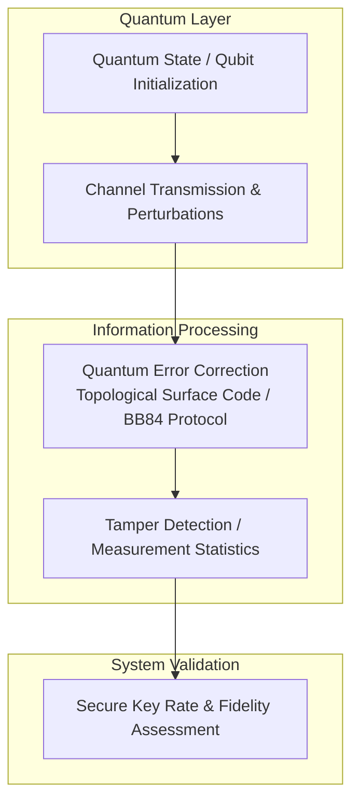

# BREAKTHROUGH 04: Quantum-Biological Navigation (Birds → Drones)

[](https://creativecommons.org/licenses/by-nc-nd/4.0/)


This repository implements the research pipeline for the **BREAKTHROUGH 04: Quantum-Biological Navigation (Birds → Drones)** project, developed by the Runtime-Slayers research group.

---

## 📊 Pipeline Architecture

The flowchart below visualizes the methodology and execution sequence implemented in this project:



---

## 🔍 Abstract & Research Context


---

## 📊 Key Evaluation Metrics

| Research Group | Institution | Key Finding |
|---------------|-------------|-------------|
| **Peter Hore** | University of Oxford, UK | Leading theorist of radical pair mechanism. Computed hyperfine tensors of FAD-Trp chain. Published models predicting compass sensitivity |
| **Henrik Mouritsen** | University of Oldenburg, Germany | Discovered CRY4 in robin retina is the magnetoreceptor (not CRY1/2). Night-vision experiments with robins |
| **Thorsten Ritz** | UC Irvine, USA | Original co-author of radical pair model. Predicted inclination compass before experimental confirmation |
| **Ilia Solov'yov** | University of Oldenburg | Molecular dynamics simulations of CRY4 protein |
| **Erik Gauger** | Heriot-Watt University, UK | Quantum theory of radical pairs, entanglement role |
| **Luca Turin** | (Various) | Quantum biology beyond magnetoreception |

---

## 📁 Repository Structure

The project directory consists of the following core structures:
  - `code/` — Pipeline execution scripts and model training modules
  - `figures/` — Plots, charts, and visualizations generated by the pipeline
  - `validation/` — Automated test metrics and results
  - `pytest.ini`
  - `requirements.txt`
  - `experiments`
  - `tests`
  - `output`
  - `code`
  - `.gitignore`
  - `figures`
  - `.github`
  - `quantum_navigation`
  - `BT04_Quantum_Biological_Navigation.md`
  - `data`
  - `paper.pdf` — Compiled research manuscript
  - `README.md` — Project documentation and setup guide

---

## 🚀 Setup and Usage

### Prerequisites
* Python 3.8 or higher
* Pip package manager

### Installation
1. Clone this repository:
   ```bash
   git clone https://github.com/Runtime-Slayers/Quantum-Biological-Magnetometry-for-GPS-Denied-Navigation.git
   cd Quantum-Biological-Magnetometry-for-GPS-Denied-Navigation
   ```
2. Install dependencies:
   ```bash
   pip install -r requirements.txt
   ```

### Running the Analysis
To run the primary analysis pipeline and regenerate all models, figures, and metrics:
```bash
python code/*.py
```
*(Look in the `code/` directory for specific pipeline execution files)*

---

## 📄 License and Copyright

This work is licensed under a [Creative Commons Attribution-NonCommercial-NoDerivatives 4.0 International License](https://creativecommons.org/licenses/by-nc-nd/4.0/).

© 2026 Runtime-Slayers / Bhavanam Rajendra Reddy et al. All rights reserved.
